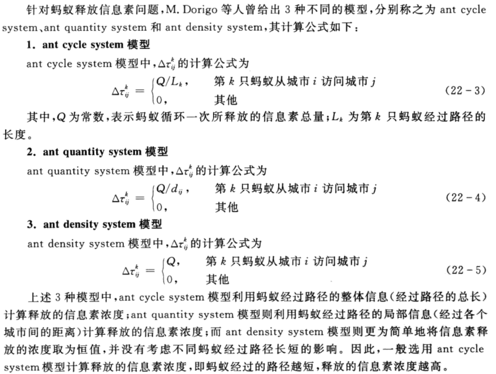

# 蚁群算法求解TSP问题

<!--
## 原理
设整个蚂蚁群体中蚂蚁的数量为$m$，城市的数量为$n$，城市$i$和城市$j$之间的距离为$d_{ij}(i,j=1,2,\cdots,n)$， $t$时刻城市$i$和城市$j$连接路径上的信息素浓度为$\tau_{ij}(t)$。初始时刻，各个城市间连接路径上的信息素浓度相同，不妨设为$\tau_{ij}(0)=\tau_0$。

蚂蚁$k, k=1,2,\ldots,m$根据各个城市间连接路径上的信息素浓度决定其下一个访问城市，设$P_{ij}^k(t)$表示$t$时刻蚂蚁$k$从城市$i$转移到城市$j$的概率，其计算公式为

-->

## 原理

## 步骤

## 特点

## 参考文献

MATLAB智能算法30个案例分析

